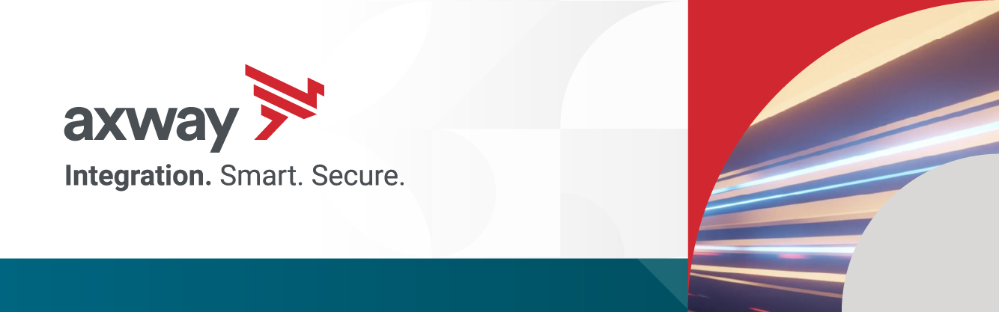

# Axway SecureTransport — Account Onboarding Portal



A Streamlit web application that automates partner account onboarding on
**Axway SecureTransport** using the ST Admin REST API v2.0.

---

> ## IMPORTANT NOTICE — PROOF OF CONCEPT
>
> **This project is provided as a proof of concept and example only.**
>
> It was created to demonstrate how the Axway SecureTransport Admin REST API can
> be used to automate account onboarding workflows. It is **not** a production-ready
> tool and has not been hardened, security-reviewed, or validated for use in
> production environments.
>
> - **Use at your own risk.** Review and adapt all code to your organisation's
>   security policies, infrastructure, and operational requirements before deploying
>   in any environment.
> - **No guarantees.** This software is provided "as-is" without warranty of any
>   kind, express or implied, including but not limited to fitness for a particular
>   purpose or correctness of results.
> - **No support.** Axway does not provide support for this project through any
>   official support channel.
> - **No maintenance commitment.** Axway will not maintain, update, or patch this
>   project. It may become outdated as SecureTransport evolves.
> - **Not an Axway product.** This is an independent example and does not represent
>   an officially released or endorsed Axway product, feature, or service.
>
> This code was authored by **Axway Professional Services** and is published as a
> reference and example of SecureTransport Admin REST API usage.

---

## Attributions

- **[Axway SecureTransport](https://www.axway.com/en/products/managed-file-transfer/secure-transport)**
  — Managed File Transfer platform by Axway. All SecureTransport product names,
  trademarks, and API definitions referenced in this project are the property of
  Axway Inc.
- **[Streamlit](https://streamlit.io)** — Open-source Python framework used to
  build the web interface. Streamlit is a product of Snowflake Inc. and is licensed
  under the Apache License 2.0.

---

| Flow | Description | API Objects Created |
|------|-------------|---------------------|
| **Inbound (CIT)** | Partner connects to ST and uploads files; ST routes to an internal recipient via Advanced Routing | Account, AdvancedRouting Subscription, COMPOSITE Route |
| **Pull (SIT Pull)** | ST connects to a partner's remote SFTP/FTP server on a schedule and retrieves files; files are then routed via Advanced Routing | Account, (SSH Certificate), Pull Transfer Site, AdvancedRouting Subscription, COMPOSITE Route |

---

## Table of Contents

1. [Prerequisites](#prerequisites)
2. [Installation and Startup](#installation-and-startup)
3. [Authentication](#authentication)
4. [Configuration Persistence (.env)](#configuration-persistence-env)
5. [Connectivity Check](#connectivity-check)
6. [Advanced Routing Prerequisites](#advanced-routing-prerequisites)
7. [Inbound (CIT) Flow — API Calls](#inbound-cit-flow--api-calls)
   - [Step 1: Create Account](#step-1-create-account)
   - [Step 2: Create AdvancedRouting Subscription](#step-2-create-advancedrouting-subscription)
   - [Step 3: Create COMPOSITE Route](#step-3-create-composite-route)
8. [Pull (SIT Pull) Flow — API Calls](#pull-sit-pull-flow--api-calls)
   - [Step 1: Create Account](#step-1-create-account-1)
   - [Step 2: Import SSH Private Key Certificate (SSH Key Auth Only)](#step-2-import-ssh-private-key-certificate-ssh-key-auth-only)
   - [Step 3: Create Pull Transfer Site](#step-3-create-pull-transfer-site)
   - [Step 4: Create AdvancedRouting Subscription](#step-4-create-advancedrouting-subscription)
   - [Step 5: Create COMPOSITE Route](#step-5-create-composite-route)
9. [AR Template ID Resolution](#ar-template-id-resolution)
10. [Response Handling — Subscription ID Capture](#response-handling--subscription-id-capture)
11. [Error Reference](#error-reference)

---

## Prerequisites

- Python 3.10 or later
- Network access to the SecureTransport Admin API endpoint (default port 444)
- A SecureTransport API key with full Admin API access
- The following objects must already exist on the ST server before running the portal:
  - An Advanced Routing application (default: `AdvRoutingApp`)
  - An Advanced Routing Package Template for each flow type:
    - Inbound (CIT): `Route to internal users shares` (default)
    - Pull (SIT Pull): `Send_To_Sharepoint` (default)

---

## Installation and Startup

```bash
# Clone the repository
git clone <repo-url>
cd MFT-ST-API-Onboarding

# Create and activate a virtual environment
python -m venv .venv
source .venv/bin/activate        # macOS / Linux
.venv\Scripts\activate           # Windows

# Install dependencies
pip install -r requirements.txt

# Start the portal
streamlit run app.py
```

The portal opens at `http://localhost:8501` by default. Navigate to
**Admin Configuration** first to configure the ST server connection.

---

## Authentication

All requests to the ST Admin REST API use an API key passed in the
`SECURETRANSPORT-API-KEY` HTTP header. No session cookie or CSRF token is required.

```
SECURETRANSPORT-API-KEY: <your-api-key>
Accept: application/json
Content-Type: application/json
```

The key is configured once in **Admin Configuration** and applied to every
subsequent API call in the session.

**Base URL format:**
```
https://<hostname>:<adminPort>/api/v2.0
```

The default admin port is `444`. The end-user REST API runs on a separate port
and is a different service — do not use it for admin operations.

---

## Configuration Persistence (.env)

Admin Configuration values are written to a `.env` file in the project root
after each save. Values are loaded at startup so they survive browser and
server restarts.

| Variable | Description |
|---|---|
| `ST_BASE_URL` | Full API base URL, e.g. `https://st.example.com:444/api/v2.0` |
| `ST_API_KEY` | Admin API key |
| `ST_VERIFY_SSL` | `true` or `false` — set `false` for self-signed certificates |
| `ST_DEFAULT_UID` | Default POSIX UID for new accounts (e.g. `65534`) |
| `ST_DEFAULT_GID` | Default POSIX GID for new accounts (e.g. `65534`) |
| `ST_HOME_FOLDER_PREFIX` | Root path for account home folders, e.g. `/files` |
| `CA_PASSWORD` | CA password used when importing SSH private key certificates |
| `ST_CIT_AR_APP` | Advanced Routing application name for the Inbound (CIT) flow |
| `ST_CIT_AR_TEMPLATE` | AR template name for the Inbound (CIT) flow |
| `ST_CIT_AR_TEMPLATE_ID` | AR template ID for the Inbound (CIT) flow (auto-resolved and cached) |
| `ST_SIT_PULL_AR_APP` | Advanced Routing application name for the Pull (SIT Pull) flow |
| `ST_SIT_PULL_AR_TEMPLATE` | AR template name for the Pull (SIT Pull) flow |
| `ST_SIT_PULL_AR_TEMPLATE_ID` | AR template ID for the Pull (SIT Pull) flow (auto-resolved and cached) |

---

## Connectivity Check

The portal verifies the connection by fetching one account. This confirms both
network reachability and that the API key has Admin API access.

**Endpoint:** `GET /accounts?limit=1`

```bash
curl -k \
  -H "SECURETRANSPORT-API-KEY: <api-key>" \
  -H "Accept: application/json" \
  "https://st.example.com:444/api/v2.0/accounts?limit=1"
```

**Success response:** `HTTP 200` with a JSON list envelope.

---

## Advanced Routing Prerequisites

Both flows use the Advanced Routing (AR) mechanism. Before running the portal you
must have the following objects already configured on the ST server.

### Advanced Routing Application

SecureTransport uses applications to automate operational workflows. An
application is a configurable object that performs a specific function — such as
moving files between accounts and systems or enforcing retention policies.
ST provides predefined application types organised into two groups:

- **Flow applications** — support file-operations workflows. They move, transform,
  route, exchange, or otherwise handle files between accounts, internal systems,
  and external partners. Accounts participate through subscriptions, which define
  how they interact with the workflow.
- **Maintenance applications** — perform scheduled system cleanup and
  data-management tasks. They enforce retention policies for accounts, logs,
  archives, and home-folder content. Maintenance applications run automatically
  and do not use subscriptions.

An administrator creates an **instance** of an application type. Each instance has
its own name and configuration and can apply globally or only to selected Business
Units. The portal does not create application instances — the AdvancedRouting
application (`AdvRoutingApp` by default) must be pre-created by an ST administrator.

To list existing applications:
```bash
curl -k \
  -H "SECURETRANSPORT-API-KEY: <api-key>" \
  "https://st.example.com:444/api/v2.0/applications?type=AdvancedRouting"
```

### Advanced Routing Package Templates

Each flow references a route template. Templates define the routing steps
(e.g. delivery to a share, email notification, forward to downstream system).
They are created in the ST Admin UI under **Advanced Routing > Route Packages**.

To list existing templates:
```bash
curl -k \
  -H "SECURETRANSPORT-API-KEY: <api-key>" \
  "https://st.example.com:444/api/v2.0/routes?type=TEMPLATE"
```

Response:
```json
{
  "result": [
    {
      "id": "8a0110919e0380a6019e038400000001",
      "name": "Route to internal users shares",
      "type": "TEMPLATE"
    },
    {
      "id": "8a0110919e0380a6019e48dd38e000ec",
      "name": "Send_To_Sharepoint",
      "type": "TEMPLATE"
    }
  ],
  "resultSet": { "count": 2 }
}
```

The portal matches the configured template name to its `id` and caches it.
See [AR Template ID Resolution](#ar-template-id-resolution) for the full lookup logic.

---

## Inbound (CIT) Flow — API Calls

The partner is the client. The partner connects to ST over any supported and
enabled inbound protocol and uploads files to their subscription folder. ST triggers Advanced Routing
to deliver the files to an internal recipient and send an email notification.

### Step 1: Create Account

**Endpoint:** `POST /accounts`

```json
{
  "name": "partner-acme",
  "type": "user",
  "uid": "65534",
  "gid": "65534",
  "homeFolder": "/files/partner-acme",
  "user": {
    "name": "partner-acme",
    "passwordCredentials": {
      "password": "S3cur3P@ssw0rd"
    }
  },
  "contact": {
    "email": "ops@acme.example.com"
  },
  "notes": "CR: CHG0012345. Demo partner account for ACME Corp.",
  "additionalAttributes": {
    "deliverTo": "hrisy",
    "recipientEmail": "hrisy@axway.com"
  }
}
```

```bash
curl -k -X POST \
  -H "SECURETRANSPORT-API-KEY: <api-key>" \
  -H "Content-Type: application/json" \
  -d '{
    "name": "partner-acme",
    "type": "user",
    "uid": "65534",
    "gid": "65534",
    "homeFolder": "/files/partner-acme",
    "user": {"name":"partner-acme","passwordCredentials":{"password":"S3cur3P@ssw0rd"}},
    "contact": {"email": "ops@acme.example.com"},
    "notes": "CR: CHG0012345",
    "additionalAttributes": {"deliverTo":"hrisy","recipientEmail":"hrisy@axway.com"}
  }' \
  "https://st.example.com:444/api/v2.0/accounts"
```

**Field notes:**
- `uid` and `gid` must be sent as **strings** even though they are numeric values —
  this is a requirement of the ST account schema.
- `additionalAttributes` keys must be 10–255 characters and match `[a-zA-Z0-9_.]+`.
  The keys `deliverTo` and `recipientEmail` are read by the Advanced Routing template
  at runtime to resolve the delivery target and notification address.
- `notes` stores a free-text description. Maximum 2048 characters.
- A password is required for Inbound (CIT) because the partner logs in directly to ST.

**Success response:** `HTTP 200` with the created account object.

---

### Step 2: Create AdvancedRouting Subscription

**Endpoint:** `POST /subscriptions`

```json
{
  "type": "AdvancedRouting",
  "folder": "/files/partner-acme",
  "account": "partner-acme",
  "application": "AdvRoutingApp"
}
```

```bash
curl -k -X POST \
  -H "SECURETRANSPORT-API-KEY: <api-key>" \
  -H "Content-Type: application/json" \
  -d '{
    "type": "AdvancedRouting",
    "folder": "/files/partner-acme",
    "account": "partner-acme",
    "application": "AdvRoutingApp"
  }' \
  "https://st.example.com:444/api/v2.0/subscriptions"
```

**Field notes:**
- `folder` is the path to the subscription folder, specified relative to the
  account's home folder. It does not need to match `homeFolder` exactly — for
  example, an account with `homeFolder: /files/partner-acme` could have a
  subscription folder of `/files/partner-acme/inbound`.
- `application` must be an existing Advanced Routing application on the server.
- No `transferConfigurations`, `schedules`, or `fileRetentionPeriod` are needed
  for CIT — the partner pushes files to the monitored folder directly.

**Success response:** `HTTP 201` with an empty body.
The subscription ID is returned in the `Location` response header:
```
Location: /api/v2.0/subscriptions/8a0110919e0380a6019e48dd38e000ec
```
The portal extracts the ID as the last path segment and uses it in the next step.
See [Response Handling](#response-handling--subscription-id-capture).

---

### Step 3: Create COMPOSITE Route

The COMPOSITE route binds the AR template to the account via the subscription.
Routing steps (delivery to recipient share, email notification) are defined in the
referenced template and inherited at runtime — the `steps` array is empty here.

**Endpoint:** `POST /routes`

```json
{
  "name": "partner-acme-composite",
  "type": "COMPOSITE",
  "conditionType": "MATCH_ALL",
  "account": "partner-acme",
  "routeTemplate": "8a0110919e0380a6019e038400000001",
  "subscriptions": ["8a0110919e0380a6019e48dd38e000ec"],
  "steps": []
}
```

```bash
curl -k -X POST \
  -H "SECURETRANSPORT-API-KEY: <api-key>" \
  -H "Content-Type: application/json" \
  -d '{
    "name": "partner-acme-composite",
    "type": "COMPOSITE",
    "conditionType": "MATCH_ALL",
    "account": "partner-acme",
    "routeTemplate": "8a0110919e0380a6019e038400000001",
    "subscriptions": ["8a0110919e0380a6019e48dd38e000ec"],
    "steps": []
  }' \
  "https://st.example.com:444/api/v2.0/routes"
```

**Field notes:**
- `routeTemplate` is the template ID resolved by name (see [AR Template ID Resolution](#ar-template-id-resolution)).
- `subscriptions` contains the ID captured from Step 2's `Location` header.
- A SIMPLE route does not need to be created — it is inherited from the template.
- If the template is scoped to a Business Unit that does not include the new account,
  ST returns HTTP 403. Make the template globally accessible or assign the account
  to the correct Business Unit.

**Success response:** `HTTP 200` with the created route object.

---

## Pull (SIT Pull) Flow — API Calls

ST is the client. ST connects to the partner's remote SFTP or FTP server on a
configurable schedule, pulls files into the account folder, and then routes them
through Advanced Routing.

### Step 1: Create Account

**Endpoint:** `POST /accounts`

```json
{
  "name": "partner-acme",
  "type": "user",
  "uid": "65534",
  "gid": "65534",
  "homeFolder": "/files/partner-acme",
  "user": {
    "name": "partner-acme",
    "passwordCredentials": {
      "password": "<auto-generated>"
    }
  },
  "contact": {
    "email": "ops@acme.example.com"
  },
  "notes": "CR: CHG0012345. Pull account — partner never logs in to ST."
}
```

**Field notes:**
- `additionalAttributes` is not required for the Pull flow.
- The account password can be auto-generated (the partner never logs in to ST for a
  server-initiated pull). The portal generates a `secrets.token_urlsafe(20)` value
  when the field is left blank.

**Success response:** `HTTP 200`.

---

### Step 2: Import SSH Private Key Certificate (SSH Key Auth Only)

This step applies only when **SSH Key** authentication is selected.

The portal generates a 2048-bit RSA key pair locally using `paramiko`. The private
key is then imported into the ST account as an SSH certificate. The matching public
key must be added to the remote server's `~/.ssh/authorized_keys` before the first
pull runs.

**Endpoint:** `POST /certificates`
**Content-Type:** `multipart/mixed`

The request body is a two-part multipart body.

Part 1 — `CertificateBody` (JSON metadata, `application/json`):
```json
{
  "name": "partner-acme-sftp-key",
  "type": "ssh",
  "usage": "private",
  "account": "partner-acme",
  "subject": "CN=partner-acme-sftp-key",
  "overwrite": "false",
  "validityPeriod": 3650,
  "caPassword": "<CA_PASSWORD from .env>"
}
```

Part 2 — `CertificateContent` (`application/octet-stream`): the PEM-encoded RSA
private key as a binary attachment named `<cert-name>.key`.

**Field notes:**
- The `Content-Type` header must be `multipart/mixed` — not `multipart/form-data`.
- `caPassword` is the CA password configured in ST, stored in `.env` as `CA_PASSWORD`.
- `validityPeriod` is in days (`3650` = 10 years).
- The certificate name becomes the alias referenced by the transfer site in Step 3.
- `overwrite: "false"` (string, not boolean) prevents accidental overwrite of an
  existing key.

**Success response:** `HTTP 200` or `HTTP 201`. The certificate ID is returned either
in the JSON response body (`{"id": "<cert-id>"}`) or in the `Location` header.
The portal checks both.

Before executing the plan, the administrator must authorise the public key on the
remote SFTP server:
```bash
echo "ssh-rsa AAAA...base64...== partner-acme-sftp-key" >> ~/.ssh/authorized_keys
```
The portal displays the full command with the generated public key.

---

### Step 3: Create Pull Transfer Site

The transfer site defines the remote endpoint ST connects to when executing a pull.

#### SFTP (SSH) Site

**Endpoint:** `POST /sites`

Password authentication:
```json
{
  "name": "partner-acme-pull-ssh",
  "type": "ssh",
  "protocol": "ssh",
  "dmz": "none",
  "host": "sftp.partner.example.com",
  "port": "22",
  "userName": "sftpuser",
  "usePassword": true,
  "password": "RemotePassword",
  "account": "partner-acme",
  "uploadFolder": "/",
  "downloadFolder": "/home/axway/download",
  "downloadPattern": "*",
  "verifyFinger": false
}
```

SSH Key authentication:
```json
{
  "name": "partner-acme-pull-ssh",
  "type": "ssh",
  "protocol": "ssh",
  "dmz": "none",
  "host": "sftp.partner.example.com",
  "port": "22",
  "userName": "sftpuser",
  "usePassword": false,
  "clientCertificate": "<cert-id-from-step-2>",
  "account": "partner-acme",
  "uploadFolder": "/",
  "downloadFolder": "/home/axway/download",
  "downloadPattern": "*",
  "verifyFinger": false
}
```

```bash
curl -k -X POST \
  -H "SECURETRANSPORT-API-KEY: <api-key>" \
  -H "Content-Type: application/json" \
  -d '{
    "name": "partner-acme-pull-ssh",
    "type": "ssh",
    "protocol": "ssh",
    "dmz": "none",
    "host": "sftp.partner.example.com",
    "port": "22",
    "userName": "sftpuser",
    "usePassword": true,
    "password": "RemotePassword",
    "account": "partner-acme",
    "uploadFolder": "/",
    "downloadFolder": "/home/axway/download",
    "downloadPattern": "*",
    "verifyFinger": false
  }' \
  "https://st.example.com:444/api/v2.0/sites"
```

**Field notes:**
- `protocol` must be set explicitly alongside `type`. ST returns HTTP 400
  (`protocol must not be null`) when it is omitted.
- `dmz` must be the string `"none"` when no DMZ zone is in use. Do not omit
  this field or pass `null`.
- `clientCertificate` is the ID of the SSH private key certificate
  imported in Step 2. Set `usePassword: false` when using key auth.
- `downloadPattern` filters which files are pulled (`"*"` = all files).
- `port` is a string, not an integer.

#### FTP / FTPS Site

**Endpoint:** `POST /sites`

```json
{
  "name": "partner-acme-pull-ftp",
  "type": "ftp",
  "protocol": "ftp",
  "dmz": "none",
  "host": "ftp.partner.example.com",
  "port": "21",
  "userName": "ftpuser",
  "usePassword": true,
  "password": "RemotePassword",
  "account": "partner-acme",
  "uploadFolder": "/",
  "downloadFolder": "/outbound",
  "downloadPattern": "*",
  "activeMode": false,
  "isSecure": false,
  "verifyCert": false
}
```

For FTPS, set `"isSecure": true`. Set `"verifyCert": false` only in non-production
environments that use self-signed certificates.

**Success response:** `HTTP 200` with the created site object.

---

### Step 4: Create AdvancedRouting Subscription

This subscription configures the pull schedule and links the transfer site so that
ST knows which remote endpoint to poll and how long to retain retrieved files.

**Endpoint:** `POST /subscriptions`

```json
{
  "type": "AdvancedRouting",
  "folder": "/files/partner-acme",
  "account": "partner-acme",
  "application": "AdvRoutingApp",
  "fileRetentionPeriod": 1,
  "transferConfigurations": [
    {
      "tag": "PARTNER-IN",
      "outbound": false,
      "site": "partner-acme-pull-ssh"
    }
  ],
  "schedules": [
    {
      "type": "HOURLY",
      "startDate": "1779339855816",
      "skipHolidays": false,
      "tag": "PARTNER-IN",
      "hourlyStep": 2,
      "hourlyType": "PERMINUTES",
      "endDate": null
    }
  ]
}
```

```bash
curl -k -X POST \
  -H "SECURETRANSPORT-API-KEY: <api-key>" \
  -H "Content-Type: application/json" \
  -d '{
    "type": "AdvancedRouting",
    "folder": "/files/partner-acme",
    "account": "partner-acme",
    "application": "AdvRoutingApp",
    "fileRetentionPeriod": 1,
    "transferConfigurations": [
      {"tag":"PARTNER-IN","outbound":false,"site":"partner-acme-pull-ssh"}
    ],
    "schedules": [
      {
        "type": "HOURLY",
        "startDate": "1779339855816",
        "skipHolidays": false,
        "tag": "PARTNER-IN",
        "hourlyStep": 2,
        "hourlyType": "PERMINUTES",
        "endDate": null
      }
    ]
  }' \
  "https://st.example.com:444/api/v2.0/subscriptions"
```

**Field notes:**
- `fileRetentionPeriod` controls the **pull history deduplication** window (the
  "Keep pull history" setting in the admin UI). ST maintains a history of
  downloaded files — recording file name, size, and last modification timestamp —
  for the number of days specified here. On each pull attempt, any file on the
  remote server whose name, size, and timestamp all match a record in that history
  window is considered identical and is **not re-downloaded**. A value of `0` or
  omitting the field disables this feature entirely. Setting it to `1` means ST
  checks against the last 1 day of download history; files pulled more than 1 day
  ago are no longer protected from re-download. ST requires `transferConfigurations`
  to include the pull site whenever this value is set — omitting the site returns
  HTTP 400: `Cannot set file retention period without setting transfer site`.
- `transferConfigurations[].site` must match the `name` of the transfer site
  created in Step 3.
- `transferConfigurations[].outbound: false` means files flow from the remote
  partner into the ST account (inbound from ST's perspective).
- `transferConfigurations[].tag` and `schedules[].tag` must both be `"PARTNER-IN"`
  for a pull schedule.
- `schedules[].hourlyType: "PERMINUTES"` with `hourlyStep: 2` means ST polls the
  remote every 2 minutes. Adjust `hourlyStep` for a different interval.
- `startDate` is the current epoch time in **milliseconds** as a string.
  The portal computes this as `str(int(time.time() * 1000))` at plan-build time.

**Success response:** `HTTP 201` with an empty body.
The subscription ID is returned in the `Location` header (same pattern as the CIT
subscription in Step 2).

---

### Step 5: Create COMPOSITE Route

The pattern is identical to the Inbound (CIT) COMPOSITE route. The only differences
are the route name, the template ID (Pull AR template instead of CIT AR template),
and the subscription ID captured in Step 4.

**Endpoint:** `POST /routes`

```json
{
  "name": "partner-acme-pull-composite",
  "type": "COMPOSITE",
  "conditionType": "MATCH_ALL",
  "account": "partner-acme",
  "routeTemplate": "8a0110919e0380a6019e48dd38e000ec",
  "subscriptions": ["8a0110919e0380a6019e48dd38e001ab"],
  "steps": []
}
```

```bash
curl -k -X POST \
  -H "SECURETRANSPORT-API-KEY: <api-key>" \
  -H "Content-Type: application/json" \
  -d '{
    "name": "partner-acme-pull-composite",
    "type": "COMPOSITE",
    "conditionType": "MATCH_ALL",
    "account": "partner-acme",
    "routeTemplate": "8a0110919e0380a6019e48dd38e000ec",
    "subscriptions": ["8a0110919e0380a6019e48dd38e001ab"],
    "steps": []
  }' \
  "https://st.example.com:444/api/v2.0/routes"
```

**Success response:** `HTTP 200`.

---

## AR Template ID Resolution

Before creating the COMPOSITE route the portal must resolve the AR template name
to its internal ID. It queries all TEMPLATE-type routes, then matches by name
(exact, then case-insensitive, then stripped of whitespace).

**Endpoint:** `GET /routes?type=TEMPLATE`

```bash
curl -k \
  -H "SECURETRANSPORT-API-KEY: <api-key>" \
  "https://st.example.com:444/api/v2.0/routes?type=TEMPLATE"
```

Response envelope:
```json
{
  "result": [
    {
      "id": "8a0110919e0380a6019e038400000001",
      "name": "Route to internal users shares",
      "type": "TEMPLATE"
    },
    {
      "id": "8a0110919e0380a6019e48dd38e000ec",
      "name": "Send_To_Sharepoint",
      "type": "TEMPLATE"
    }
  ],
  "resultSet": { "count": 2 }
}
```

Once resolved, the ID is written back to `.env` (`ST_CIT_AR_TEMPLATE_ID` or
`ST_SIT_PULL_AR_TEMPLATE_ID`) and reused on the next run without another lookup.

Template IDs can also be pre-configured in **Admin Configuration** to skip
runtime resolution entirely.

---

## Response Handling — Subscription ID Capture

`POST /subscriptions` always returns `HTTP 201` with an **empty body**. The resource
ID is returned only in the `Location` response header:

```
Location: /api/v2.0/subscriptions/8a0110919e0380a6019e48dd38e000ec
```

The portal extracts the ID as the last path segment:
```python
location = response.headers.get("Location", "")
sub_id = location.rstrip("/").split("/")[-1]
```

This ID is then substituted into the `subscriptions` field of the COMPOSITE route
payload before the route creation call is made.

If the Location header is absent or empty, the portal shows a warning and stops
execution to prevent the COMPOSITE route from being created with an unresolved
placeholder — sending a literal `${sub_id}` to ST causes a server-side error.

---

## Error Reference

| HTTP Status | Endpoint | Cause | Resolution |
|---|---|---|---|
| 400 | `POST /accounts` | `uid`/`gid` sent as integers instead of strings | Send as `"65534"` (quoted) |
| 400 | `POST /accounts` | `additionalAttributes` key shorter than 10 characters | Use keys of 10+ characters |
| 400 | `POST /sites` | `protocol must not be null` | Add `"protocol": "ssh"` / `"ftp"` / `"http"` to the site payload |
| 400 | `POST /sites` | `dmz` value missing or null | Set `"dmz": "none"` (the string) — not `null` |
| 400 | `POST /subscriptions` | `Cannot set file retention period without setting transfer site` | Include `transferConfigurations` with the pull site name when `fileRetentionPeriod` is set |
| 400 | `POST /routes` | `${sub_id}` or similar literal in `subscriptions` field | The preceding subscription step did not return a `Location` header; inspect that step's response |
| 401 | Any | API key invalid or not provided | Verify the `SECURETRANSPORT-API-KEY` value in Admin Configuration |
| 403 | `POST /routes` | Template not accessible to the account | Make the AR template globally accessible in ST Admin, or assign the account to the template's Business Unit |
| 404 | Any | Referenced resource not found | Verify the account, application, template, or subscription was created successfully in the preceding step |
| 409 | `POST /accounts` | Account already exists | Choose a different account name or delete the existing account first |

---

## Object Naming Convention

The portal derives all object names from the account name to avoid collisions:

| Object | Name Pattern | Example |
|---|---|---|
| Account | `<account>` | `partner-acme` |
| Home folder | `<prefix>/<account>` | `/files/partner-acme` |
| Pull site (SFTP) | `<account>-pull-ssh` | `partner-acme-pull-ssh` |
| Pull site (FTP) | `<account>-pull-ftp` | `partner-acme-pull-ftp` |
| SSH certificate | `<account>-sftp-key` | `partner-acme-sftp-key` |
| CIT subscription composite route | `<account>-composite` | `partner-acme-composite` |
| Pull subscription composite route | `<account>-pull-composite` | `partner-acme-pull-composite` |

---

## Implementation Notes

### Object Creation Order

Objects must be created in the exact sequence shown above. Each step depends on the
result of the previous one. The portal stops on the first failure to prevent partial
configuration drift.

### Failure Recovery

If execution stops mid-way, check which objects were created before retrying:
```bash
# Check account
curl -k -H "SECURETRANSPORT-API-KEY: <api-key>" \
  "https://st.example.com:444/api/v2.0/accounts/partner-acme"

# Check site
curl -k -H "SECURETRANSPORT-API-KEY: <api-key>" \
  "https://st.example.com:444/api/v2.0/sites/partner-acme-pull-ssh"

# Check routes for the account
curl -k -H "SECURETRANSPORT-API-KEY: <api-key>" \
  "https://st.example.com:444/api/v2.0/routes?account=partner-acme"
```

Delete any partially created objects before re-running, or use a different account name.

### UID and GID

ST virtual user accounts do not map to OS-level POSIX users. UID/GID values are
stored in the ST database only. `65534` (nobody/nogroup) is the common default.
Confirm the acceptable range with your ST system administrator.

### API Version

The Admin REST API documented here applies to **SecureTransport 5.5-20260430 and later**.
To confirm the API version on your server:
```bash
curl -k -H "SECURETRANSPORT-API-KEY: <api-key>" \
  "https://st.example.com:444/api/v2.0/version"
```

